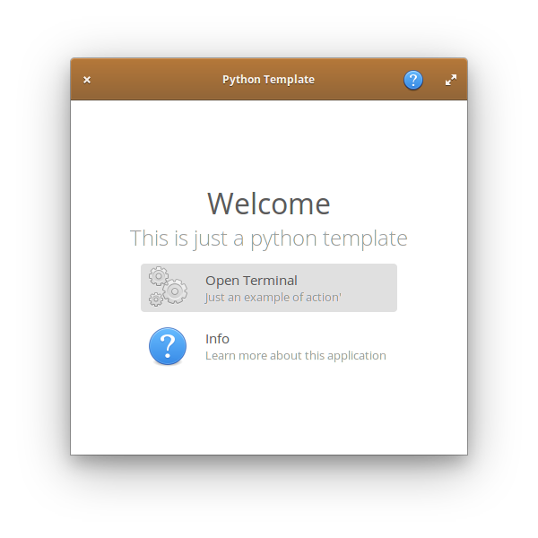

# Elementary Python

This is a python application template for elementary OS.


## Requirements

- python3
- libgtk-3-dev
- libgranite-dev 

## How to run

```bash
com.github.mirkobrombin.elementarypython
```

## Installation

### For Debian based

Grab an updated debian package [here](https://github.com/mirkobrombin/ElementaryPython/releases)

```bash
dpkg -i com.github.mirkobrombin.elementarypython*.deb
```

### Install from source

Grab an updated release [here](https://github.com/mirkobrombin/ElementaryPython/archive/master.zip) or use **git**:

```bash
git clone https://github.com/mirkobrombin/ElementaryPython.git
cd ElementaryPython
sudo python3 setup.py install
```

